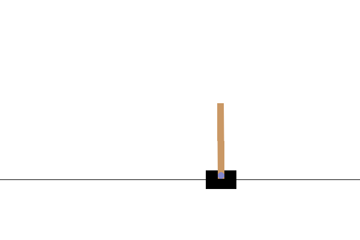

# Playing CartPole with the Actor-Critic Method

[](https://svgshare.com/i/ZhY.svg)
[](https://github.com/ThomasByr/RL-CartPole/blob/master/LICENSE)
[](https://GitHub.com/ThomasByr/RL-CartPole/commit/)
[](https://gitHub.com/ThomasByr/RL-CartPole/commit/)
[](https://GitHub.com/ThomasByr/RL-CartPole/graphs/commit-activity)

[](https://github.com/ThomasByr/RL-CartPole/actions/workflows/python-app.yml)
[](https://github.com/ThomasByr/RL-CartPole/actions/workflows/pylint.yml)
[](https://github.com/ThomasByr/RL-CartPole)
[](https://github.com/ThomasByr)



In the [CartPole environment](https://www.gymlibrary.ml/environments/classic_control/cart_pole/), a pole is attached to a cart moving along a frictionless track. The pole starts upright and the goal of the agent is to prevent it from falling over by applying a force of -1 or +1 to the cart. A reward of +1 is given for every time step the pole remains upright. An episode ends when (1) the pole is more than 15 degrees from vertical or (2) the cart moves more than 2.4 units from the center.

1. [✏️ Setup](#️-setup)
2. [💁 Additional info](#-additional-info)
3. [🧪 Testing](#-testing)
4. [⚖️ License](#️-license)
5. [🐛 Bugs & TODO](#-bugs--todo)

## ✏️ Setup

Please make sure you have the necessary library up and ready on your environment :

```ps1
pip install -r .\requirements.txt
```

This script is suppose to run on `python>=3.10.4`.

## 💁 Additional info

Tensorflow compatibility with NVidia GPUs (_not required_)

[This](https://www.tensorflow.org/install/gpu) is the page you are looking for. TL;DR :

- [450.80.02](https://www.nvidia.com/en-us/geforce/geforce-experience/) minimum graphics drivers
- [CUDA Toolkit](https://developer.nvidia.com/cuda-toolkit-archive)
- [NVIDIA cuDNN](https://developer.nvidia.com/cudnn) (please refer to [this guide](https://docs.nvidia.com/deeplearning/cudnn/install-guide/index.html#install-windows))

Then setup `PATH` variables, were `x` is the minor of the CUDA toolkit you have installed (make sure the paths are correct) :

```ps1
SET PATH=C:\Program Files\NVIDIA GPU Computing Toolkit\CUDA\v11.x\bin;%PATH%
SET PATH=C:\Program Files\NVIDIA GPU Computing Toolkit\CUDA\v11.x\extras\CUPTI\lib64;%PATH%
SET PATH=C:\Program Files\NVIDIA GPU Computing Toolkit\CUDA\v11.x\include;%PATH%
SET PATH=C:\tools\cuda\bin;%PATH%
```

Also make sure the [compute capability](https://docs.nvidia.com/cuda/cuda-c-programming-guide/index.html#compute-capabilities) of the GPU isn't slowing down the hole process due to the (non)atomicity of certain operations. Furthermore, using GPU isn't going to be particularly helpfull with a small number of features to train (we have only 1027 features in total to train, which is a very small number). Benefits will increase as the number of features to train goes [past 4000](https://stackoverflow.com/questions/55749899/training-a-simple-model-in-tensorflow-gpu-slower-than-cpu) or so.

## 🧪 Testing

Run and train the simulation with (ignore tf warnings):

```ps1
python .\main.py -c 1 --cpu 2> $null
```

If the model is not trained, the program will launch a training session. Otherwise (if there is a model to load in the [models folder](models/)), the weights of the previously trained model will be loaded. Then, either a gif image will be created or interractive mode will be entered depending on commented features.

To force the training, please type the following and the re-run the script :

```ps1
rm -r -Force models/*
```

Please note that the training could take up to 5 minutes depending on your hardware and / or the specified goals of the model. Please type `python .\main --help` to view the launching available options.

## ⚖️ License

This project is licensed under the GPL-3.0 new or revised license. Please read the [LICENSE](LICENSE) file.

- Redistributions of source code must retain the above copyright notice, this list of conditions and the following disclaimer.
- Redistributions in binary form must reproduce the above copyright notice, this list of conditions and the following disclaimer in the documentation and/or other materials provided with the distribution.
- Neither the name of the authors nor the names of its contributors may be used to endorse or promote products derived from this software without specific prior written permission.

THIS SOFTWARE IS PROVIDED BY THE COPYRIGHT HOLDERS AND CONTRIBUTORS "AS IS" AND ANY EXPRESS OR IMPLIED WARRANTIES, INCLUDING, BUT NOT LIMITED TO, THE IMPLIED WARRANTIES OF MERCHANTABILITY AND FITNESS FOR A PARTICULAR PURPOSE ARE DISCLAIMED. IN NO EVENT SHALL THE COPYRIGHT HOLDER OR CONTRIBUTORS BE LIABLE FOR ANY DIRECT, INDIRECT, INCIDENTAL, SPECIAL, EXEMPLARY, OR CONSEQUENTIAL DAMAGES (INCLUDING, BUT NOT LIMITED TO, PROCUREMENT OF SUBSTITUTE GOODS OR SERVICES; LOSS OF USE, DATA, OR PROFITS; OR BUSINESS INTERRUPTION) HOWEVER CAUSED AND ON ANY THEORY OF LIABILITY, WHETHER IN CONTRACT, STRICT LIABILITY, OR TORT (INCLUDING NEGLIGENCE OR OTHERWISE) ARISING IN ANY WAY OUT OF THE USE OF THIS SOFTWARE, EVEN IF ADVISED OF THE POSSIBILITY OF SUCH DAMAGE.

## 🐛 Bugs & TODO

**bugs** (final correction patch version)

- deprecated packages in imported libs : to be removed in python 3.12 and pillow 10
- ~~cudart64_x.dll not found~~ : resolved locally (v1.1.5)
- tensorflow warnings about deleted checkpoint with unrestored values when not saving final run as gif or not running the "interactive" mode

**todo** (first implementation version)

- [x] CartPole-v0 -> CartPole-v1 : kept both (v1.1.0)
- [x] manually tilt the cart : (v1.1.3)
- [x] unable to find and utilize gpu : (v1.1.5)
- [ ] distributed learning
- [ ] linux compatible versions
